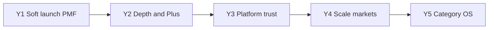

# Nestly — 5-year plan

**North star:** Become the first app a family opens each day to answer *“What does our nest need today?”*

**Tagline:** The operating system for modern families.

**Horizon:** Mid-2026 → mid-2031 (five years from the soft-launch baseline).

**Defaults locked for this plan**
- Core family OS stays free enough that a household can run on Nestly without paying
- Nestly Plus is optional depth (AI, storage, multi-nest, advanced care) — not a gate on sync
- Flutter + Drift offline-first + Firebase remains the stack unless a hard limit forces change
- Primary beachhead: couples and parents with school-age kids in English-speaking markets
- Quiet product language — summaries and suggestions, not chatbots as the default UX

---

## Where we are (baseline, mid-2026)

**Shipped**
- Nest create/join, email auth, offline-first Drift ↔ Firestore sync
- Home “Today for your nest”, calendar, tasks, shopping, expenses/bills
- Meals → shopping, care schedules, school activities, vault, timeline
- Document scan via Firebase AI Logic (Gemini), grocery restock habits
- Web companion (calendar / tasks / lists), privacy export + delete account
- Warm onboarding, layout-matched home loading, edit depth across modules

**Still manual / open**
- Store closed testing → public listing (Play / App Store)
- Apple / Google sign-in
- Nestly Plus paywall (explicitly deferred)
- Custom domain for privacy/support web pages

**Year-1 lesson:** Families adopt Nestly when *today* is obvious and sync is boringly reliable — not when features are numerous.

---

## Year 1 — Soft launch & product-market fit  
*(through ~mid-2027)*

**Goal:** Real households use Nestly as their shared daily hub; retention beats novelty.

### Outcomes
- Public listings live on iOS and Android (`app.nestly.family`)
- ≥1,000 nests created; ≥30% weekly active among nests with 2+ members
- Crash-free sessions and sync success rates treated as product features
- Clear answer to: “Would you notice if Nestly disappeared for a week?”

### Build / ship
| Quarter | Focus |
|--------|--------|
| **H2 2026** | Store submission, screenshots, Data Safety / App Privacy, crash + analytics baseline |
| **H1 2027** | Apple/Google sign-in, invite polish, empty-state coaching, notification reliability |
| **Ongoing** | Bug bash from closed testers; kill sharp edges in vault upload and nest join |

### Explicit non-goals
- No paywall yet
- No marketplace / third-party plugins
- No “family social network” feed wars — timeline stays light

### Success metric
*Nestly is how this family coordinates weekdays* — qualitative interviews + WAU/nest.

---

## Year 2 — Depth, quiet AI, Nestly Plus  
*(~mid-2027 → mid-2028)*

**Goal:** Go from “useful list of modules” to “the nest runs smoother because Nestly is there.”

### Product depth
- Recurring calendar intelligence (school year patterns, holiday gaps)
- Shared budgets with soft category insights (still household-simple)
- Care + school as first-class “who’s responsible” flows
- Vault: expiry reminders, share packs for trips / emergencies
- Web companion parity for calendar/tasks/lists + light bills view

### Quiet AI (Nestly Plus–ready)
- Scan → structured drafts remains free or lightly limited
- Plus: multi-document batch, smarter meal↔shop planning, “week preview” narrative
- Always review-before-save; never auto-commit family data from a model

### Monetization
- Introduce **Nestly Plus** as optional subscription
- Free: full nest sync, core modules, basic reminders
- Plus: higher vault storage, advanced AI assists, multi-device priority sync, export packs
- Pricing target: family-plan friendly (one subscription covers the nest)

### Success metrics
- Plus attach rate among nests active 4+ weeks
- Time-to-first “aha” (second member joins + first shared check-off) under 10 minutes
- Support tickets per active nest trending down

---

## Year 3 — Platform trust & multi-generation  
*(~mid-2028 → mid-2029)*

**Goal:** Nestly becomes trusted infrastructure — including grandparents and caregivers — not only tech-forward parents.

### Trust & safety
- Role-aware permissions (kids see less; caregivers see assigned care only)
- Audit-friendly activity for sensitive vault changes
- Regional privacy modes; clearer data residency story as Firebase options allow
- SOC2-minded ops habits even if certification comes later

### Multi-generation UX
- Larger-type / simplified “Grandparent mode”
- Shared photo moments without becoming Instagram
- Care notes that travel with elder / pet profiles

### Selective integrations (thin, reversible)
- Calendar subscribe/export (ICS) before deep Google/Apple write-back
- Optional map/deep-link for school pickup locations
- No dependency that breaks offline-first

### Org
- Small squad: 1–2 full-time eng + design contractor + founder product
- Paid community / waitlist for Plus features

### Success metrics
- Nests with 3+ generations or caregiver roles growing
- Churn after Plus trial under category average
- NPS among weekly-active nests ≥ 40

---

## Year 4 — Scale markets & reliability as moat  
*(~mid-2029 → mid-2030)*

**Goal:** Same product truth in a second major market; Nestly feels inevitable for “household OS.”

### Expansion
- Second English market (e.g. UK/AU/CA) with local defaults (date, currency, school terms)
- Localization foundation (strings, RTL readiness) even if second language ships late Year 4
- Partner pilots: schools, pediatric clinics, or family-office adjacent — *light*, not enterprise bloat

### Reliability & platform
- Conflict UX beyond last-write-wins for high-stakes fields (bills paid, vault title)
- Background sync health dashboard for power users
- Tablet / foldable layouts; better web companion as “desk mode”
- Performance budget: cold start and home “today” under fixed ms targets on mid-range Android

### Business
- Nestly Plus as majority of revenue; explore Nestly for Teams (nanny share / co-parenting packs) carefully
- Brand: consistent “operating system for modern families” across store, web, and PR

### Success metrics
- Double active nests YoY
- Plus ARR covers core team burn
- ≤0.5% of sessions with sync hard-failure

---

## Year 5 — Category OS  
*(~mid-2030 → mid-2031)*

**Goal:** When people say “family OS,” they mean Nestly — or Nestly is the default comparison.

### Product identity
- One coherent “Today” runtime: calendar + tasks + care + money + meals as one composition, not a dashboard of apps
- Nest templates (new baby, divorce co-parenting, multi-home kids, elder care) as guided setups
- Developer-facing Nestly kit only if it strengthens the core (widgets, shortcuts, complications) — not a noisy API marketplace

### Moats to reinforce
1. **Offline-first household truth** that still syncs
2. **Quiet AI** that drafts; humans decide
3. **Nest membership model** (one bill, many roles) competitors bolt on late
4. **Trust surface** (vault + emergency + export/delete) done properly

### Optional big bets (pick ≤2)
- Hardware-adjacent: shared kitchen display / tablet mode
- Insurance or benefits partnerships that never own family data
- Lightweight open protocols for calendar/task interchange

### Success metrics
- Category brand search and direct installs meaningfully organic
- Multi-year nest retention (families still active after 24 months)
- Clear path to profitable independence or a mission-aligned strategic option

---

## Cross-cutting principles (all five years)

1. **Today first** — Home must answer today’s nest needs in one glance.
2. **Offline is real** — airplanes, basements, and school pickup lots count.
3. **No dark patterns** — Plus is optional; delete account and export always work.
4. **Quiet > clever** — Prefer one excellent summary over five AI party tricks.
5. **Ship thin, deepen** — Modules earn depth after weekly usage, not at invent time.
6. **Family roles > user accounts** — Design for mom/dad/kid/grandparent/caregiver, not generic “users.”

---

## Investment & capacity (indicative)

| Phase | Team shape | Spend focus |
|-------|------------|-------------|
| Y1 | Founder + AI/contract help | Stores, crash/analytics, auth providers |
| Y2 | +1 eng | Plus billing, AI gateway costs, storage |
| Y3 | +design / support part-time | Trust, accessibility, integrations |
| Y4 | Small product squad | Markets, reliability, tablet/web |
| Y5 | Stable squad | Brand, templates, selective bets |

Exact headcount follows revenue and Plus attach — this plan prefers **profitability discipline** over vanity growth.

---

## Risks & mitigations

| Risk | Mitigation |
|------|------------|
| Families already use shared Notes / WhatsApp | Win on *structured today* + offline + roles, not chat |
| AI cost spikes | Hard caps, Plus gating for heavy AI, cache drafts |
| Sync conflicts erode trust | Start with clearer merge UX on money/vault; add CRDT only if needed |
| Store rejection / privacy scrutiny | Keep privacy HTML + in-app controls current; no stealth tracking |
| Scope creep into “super app” | Every feature must improve “what does our nest need today?” |

---

## Near-term checklist (next 90 days)

Detailed week-by-week: [`FOUR_MONTH_PLAN.md`](FOUR_MONTH_PLAN.md) (Aug–Nov 2026 v3 — App Store live, **web paused**, **no domain required**).

**Email spam:** Without a domain, Inbox delivery can’t be guaranteed — use Change password + Spam guidance now; run Appendix A when you buy a domain.

Aligned with this plan’s Year 1 finish line:

1. Complete `STORE_CHECKLIST.md` and submit closed → public tracks  
2. Enable Apple / Google sign-in  
3. Point `nestly.app` (or equivalent) at privacy/support  
4. Instrument retention: nest created → second member → day-7 return  
5. Decide Nestly Plus packaging draft (still **ship free** until metrics support paywall)

---

## How to use this document

- **Quarterly:** mark shipped items in `README.md` Year status; adjust only the *current* year in detail  
- **Annually:** rewrite the next year’s outcomes with real metrics; keep Years 4–5 directional  
- **When tempted to pivot:** check the north star and the six principles before adding surface area  

Nestly’s job for five years stays the same: make the modern family’s operating day feel calm, shared, and under control.
