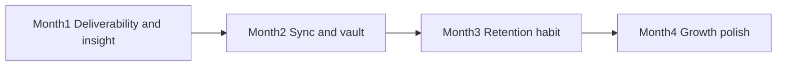
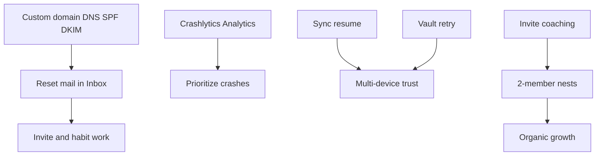

# Nestly — 4-month week-by-week plan (revised)

**Window:** Week of **3 Aug 2026 → 22 Nov 2026** (16 weeks)  
**Context (30 Jul 2026):** Nestly is **already live on the App Store**. Product surface is largely complete.  
**North star:** Grow real multi-member nests; make daily sync and account recovery trustworthy.  
**Aligned with:** [`FIVE_YEAR_PLAN.md`](FIVE_YEAR_PLAN.md) Year 1 finish line  

### Locked decisions for this plan
| Do | Don’t |
|----|--------|
| Fix password-reset email spam / deliverability | Social login (Google / Apple) — **deferred** |
| Crash + analytics, sync reliability, retention | Rewrite Firestore rules — **skip** |
| Vault upload retry, invite coaching, notifications | Rewrite Storage rules — **skip** |
| Play Store / App Store growth polish as needed | Web companion deepen — **skip** |
| Nestly Plus **packaging draft only** (Week 16) | Nestly Plus paywall / billing |

---

## Analysis snapshot (revised)

### Already done
- App Store release live  
- Core family OS: Home Today, calendar, tasks, shopping, money, meals, care, school, vault, emergency, scan AI, onboarding, privacy export/delete, password reset UI  
- Offline Drift + Firestore sync  
- Web companion exists but **out of scope** this cycle  

### Highest-impact problems now
| Problem | Impact |
|---------|--------|
| **Password reset emails land in Spam** | Users can’t recover accounts → support load + churn |
| Sync is pull-on-mutation, failures often silent | “Is my partner seeing this?” distrust |
| Vault uploads can defer with weak retry UX | Lost documents feeling |
| Weak funnel visibility (no/limited Crashlytics + Analytics) | Flying blind post-launch |
| Invite / empty-state coaching thin | Single-member nests never become family OS |
| Showcase seed may still be reachable | Accidental demo wipe of real nests |

### Explicit non-goals
- Social auth  
- Security rules rewrite (Firestore / Storage)  
- Web companion features  
- New major modules  
- Paywall  

---

## Month 1 — Deliverability & product insight  
**Theme:** Account recovery works; you can see crashes and usage.

### Week 1 — 3–9 Aug · Password-reset email out of Spam (P0)
**Goal:** Reset mail arrives in Inbox from a Nestly-branded domain.

Firebase’s default `noreply@…firebaseapp.com` / `*.firebaseapp.com` senders are frequently spam-foldered. Fix is **custom auth email domain + DNS**, optionally custom SMTP.

| Type | Work |
|------|------|
| **Manual** | Own/use `nestly.app` (or mail subdomain e.g. `mail.nestly.app`) |
| **Manual** | Firebase Console → Authentication → Templates → Password reset → **Customize domain** |
| **Manual** | Add Firebase-provided **TXT / CNAME** (and merge **SPF** into a single `v=spf1 … include:_spf.firebasemail.com` record — never two SPF TXT records) |
| **Manual** | Wait for verification (often &lt;24h, up to 48h) → **Apply custom domain** |
| **Manual** | Customize template: From name `Nestly`, clear subject (“Reset your Nestly password”), short body, Reply-To `support@nestly.app` |
| **Manual** | Optional stronger path: Templates → **SMTP** → send via Google Workspace / Resend / SendGrid with their SPF/DKIM |
| **Build** | Reset screen copy: “Check Inbox **and Spam**”; show which address was used |
| **Build** | Optional: `ActionCodeSettings` with `handleCodeInApp` / continue URL on your domain when ready |
| **Manual** | Test Gmail, iCloud, Outlook — confirm Inbox (not Spam) |

**Exit:** ≥2 real inboxes receive reset mail in **Inbox**; spam rate subjectively fixed for primary test accounts.

---

### Week 2 — 10–16 Aug · Auth email hygiene + recovery UX
**Goal:** All Auth emails (reset, and verification if used) share brand + clear in-app guidance.

| Type | Work |
|------|------|
| **Manual** | Apply same custom domain to other Auth templates you use |
| **Manual** | DMARC for domain (`v=DMARC1; p=none; rua=mailto:…`) once SPF/DKIM pass — start monitor-only |
| **Build** | Post-send UI: “Sent to X — allow a minute; check Spam once” |
| **Build** | Support path: Nest / About / Support mailto with “reset email” preset subject |
| **Build** | Gate showcase seed to debug/profile only if not already |
| **Manual** | Document DNS records in `store/` or ops note so they aren’t lost |

**Exit:** Recovery flow documented; showcase can’t run in App Store build.

---

### Week 3 — 17–23 Aug · Crashlytics + Analytics
**Goal:** Post-launch visibility.

| Type | Work |
|------|------|
| **Build** | Firebase Crashlytics (iOS; Android if Play build exists) |
| **Build** | Analytics events: `sign_up`, `login`, `nest_created`, `nest_joined`, `password_reset_requested`, `sync_success`, `sync_fail` |
| **Build** | Non-fatal logging on sync failures (no nest content PII) |
| **Manual** | Verify events in console from production or TestFlight |

**Exit:** Crash-free users + funnel events visible for live installs.

---

### Week 4 — 24–30 Aug · Play Store / listing hygiene (as needed)
**Goal:** Android path or App Store listing polish — no Month-1 “first submit” work.

| Type | Work |
|------|------|
| **Manual** | If Play not live: submit / staged rollout; if live: review replies + screenshots refresh |
| **Manual** | Privacy/support URLs prefer `nestly.app` once DNS ready (from Weeks 1–2) |
| **Build** | Hotfix notes for App Store Connect |
| **Build** | Fix top crash from Week 3 |
| **Manual** | Confirm password-reset still Inbox after domain apply |

**Exit:** Store presence healthy; no open P0 crashes; email deliverability still green.

---

## Month 2 — Sync & vault reliability  
**Theme:** Partners see the same nest without hunting a Sync button.

### Week 5 — 31 Aug–6 Sep · Sync on resume + visible failures
| Type | Work |
|------|------|
| **Build** | Debounced `syncAll()` on app resume / foreground |
| **Build** | User-visible sync failure (SnackBar or Nest banner) |
| **Build** | “Last synced” on Nest screen |
| **Build** | Stop swallowing critical mutation sync errors |
| **Build** | Analytics: sync latency / fail count |

**Exit:** Offline edit → online → auto-sync within ~5s; failures visible.

---

### Week 6 — 7–13 Sep · Vault upload retry
| Type | Work |
|------|------|
| **Build** | Pending upload queue + retry |
| **Build** | Row status: Local / Uploading / Synced / Failed |
| **Build** | “Retry uploads” action on Vault |
| **Manual** | Airplane pick → reconnect → file appears in Storage |

**Exit:** No silent forever-deferred vault files in normal network conditions.

---

### Week 7 — 14–20 Sep · Sync edge-case bash
| Type | Work |
|------|------|
| **Manual** | Two-device matrix: iPhone + second device (or web login only for *observation*, no web feature work) |
| **Build** | Fix P0 sync bugs only (missing items, duplicate rows, stuck dirty) |
| **Build** | Clarify grocery habits as “On this device” **or** add nest sync for habits (pick one) |
| **Build** | Delete dead `mock_data.dart` if unused |

**Exit:** Written “known sync behaviors”; no P0 data-loss bugs.

---

### Week 8 — 21–27 Sep · Notification foundation
| Type | Work |
|------|------|
| **Build** | Notification tap → Expenses / Care / School screens |
| **Build** | Re-schedule reminders after successful sync pull |
| **Build** | Permission rationale on Nest |
| **Manual** | Bill / care reminder on physical devices |

**Exit:** Tapping a reminder opens the right module.

---

## Month 3 — Retention habit  
**Theme:** Second member + weekly return.

### Week 9 — 28 Sep–4 Oct · Funnel instrumentation
| Type | Work |
|------|------|
| **Build** | Events: `onboarding_complete`, `invite_copied`, `second_member_joined`, `first_task_done`, `day7_open` |
| **Manual** | Dashboard: % nests with 2+ members by day 7 |
| **Build** | Fix top production crash |

**Exit:** You can quote second-member join rate from live data.

---

### Week 10 — 5–11 Oct · Invite coaching
| Type | Work |
|------|------|
| **Build** | After nest create: “Invite your partner” sheet (share code + share sheet) |
| **Build** | Home empty-state CTA when alone in nest |
| **Build** | Paste-friendly invite code UX |
| **Manual** | 5 friend/family installs timed to first shared check-off |

**Exit:** Scripted path signup → invite → join → check-off ≤10 minutes.

---

### Week 11 — 12–18 Oct · Empty-state coaching
| Type | Work |
|------|------|
| **Build** | First-run tips on Calendar / Tasks / Shop (one-tap seed actions, not demo wipe) |
| **Build** | Home “Today” empty copy honest + actionable |
| **Build** | Onboarding AI copy: quiet scan assist — no overclaim |
| **Build** | Soft budget: editable month budget (replace hardcoded 1800) |

**Exit:** New nest doesn’t feel abandoned before first data.

---

### Week 12 — 19–25 Oct · Retention bug bash
| Type | Work |
|------|------|
| **Manual** | Support inbox triage: reset email, join, vault, sync |
| **Build** | P0/P1 fixes only |
| **Manual** | Re-verify reset emails still Inbox after any template change |
| **Build** | Regression tests for invite + sync resume where feasible |

**Exit:** Support themes dominated by “how do I…” not “it’s broken.”

---

## Month 4 — Growth polish (still free)  
**Theme:** Quality and clarity for organic App Store growth.

### Week 13 — 26 Oct–1 Nov · Performance & stability
| Type | Work |
|------|------|
| **Build** | Home cold-start / Today build profiling on mid iPhone |
| **Build** | Crashlytics top-5 crash burn-down |
| **Build** | Reduce unnecessary full `syncAll` thrash |
| **Manual** | App Store “What’s New” for stability release |

**Exit:** Crash-free sessions trending up vs Week 3 baseline.

---

### Week 14 — 2–8 Nov · Accessibility pass
| Type | Work |
|------|------|
| **Build** | Semantics on Home FAB, tab bar, invite, reset password |
| **Build** | Dynamic Type spot-check Auth + Nest |
| **Build** | Respect reduce-motion for shimmer loops |
| **Manual** | VoiceOver walkthrough: reset password + invite |

**Exit:** Critical paths usable with VoiceOver.

---

### Week 15 — 9–15 Nov · Nest settings & trust UX
| Type | Work |
|------|------|
| **Build** | Nest: clearer member list, code, last sync, change password entry |
| **Build** | Privacy screen: short “Emails from Nestly” note (check Spam once; branded From) |
| **Build** | Emergency + vault share polish only if low risk |
| **Manual** | Update App Store screenshots if Home/Nest changed visually |

**Exit:** Nest tab feels like the account/trust center.

---

### Week 16 — 16–22 Nov · Stabilize + Plus draft (no ship)
| Type | Work |
|------|------|
| **Manual** | Review replies; only P0 hotfixes |
| **Manual** | Nestly Plus one-pager (free vs Plus) — **do not implement** |
| **Manual** | Update README / FIVE_YEAR_PLAN checkboxes |
| **Manual** | Retro: keep / kill / delay for H1 2027 (social auth timing, rules, web) |

**Exit:** Stable live app; Plus draft filed; next-quarter priorities chosen.

---

## Week-by-week scoreboard

| Week | Theme | Exit |
|------|--------|------|
| 1 | Custom domain + SPF/DKIM for reset mail | Inbox, not Spam |
| 2 | Email hygiene + showcase gate | Recovery UX clear |
| 3 | Crashlytics / Analytics | Events live |
| 4 | Store hygiene | Healthy listing |
| 5 | Sync resume | Auto sync + visible fail |
| 6 | Vault retry | Uploads recover |
| 7 | Sync bash | No P0 data loss |
| 8 | Notification taps | Routes work |
| 9 | Funnel metrics | 2-member rate known |
| 10 | Invite coaching | ≤10 min aha |
| 11 | Empty states + budget | New nests guided |
| 12 | Retention bash | Support calmer |
| 13 | Stability release | Crashes down |
| 14 | Accessibility | VoiceOver OK |
| 15 | Nest trust UX | Nest = account hub |
| 16 | Plus draft only | Retro done |

---

## Metrics to watch (weekly)

| Metric | Target by Week 16 |
|--------|-------------------|
| Reset email deliverability | Inbox on Gmail + iCloud test accounts |
| Crash-free sessions | ≥99% |
| Nests with 2+ members (age ≥7d) | Improving week over week |
| Sync fail event rate | Down after Week 5 |
| Support: “reset email / spam” tickets | Near zero after Week 2 |
| Day-7 return | Track + improve |

---

## Dependency map (this revision)

---

## How to run this plan

1. **Week 1 is non-negotiable** — don’t start Month 2 polish until reset mail is Inbox.  
2. Monday: pick Build + Manual; Friday: pass/fail exit criteria.  
3. Slip only into Weeks 7 / 12 / 16 buffers.  
4. Do **not** pull social auth, rules, or web into this cycle without rewriting this doc.  
5. Log DNS / SMTP settings so deliverability doesn’t regress.

---

## Related docs
- [`FIVE_YEAR_PLAN.md`](FIVE_YEAR_PLAN.md)  
- [`STORE_CHECKLIST.md`](STORE_CHECKLIST.md) — historical; App Store already live  
- [`store/APP_STORE_LISTING.md`](store/APP_STORE_LISTING.md)  
- [`README.md`](README.md)  

**Bottom line:** You’re past “ship the store.” These 16 weeks make **account recovery reliable**, **sync trustworthy**, and **nests multi-member** — without social auth, rules rewrites, or web scope.
