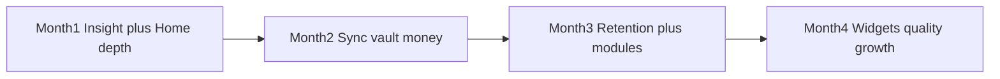

# Nestly — 4-month week-by-week plan (v3)

**Window:** **3 Aug 2026 → 22 Nov 2026** (16 weeks)  
**Context:** App Store **already live**. Core family OS largely shipped.  
**North star:** Multi-member nests that trust sync, recover accounts, and open Nestly for *today*.  

### Locked decisions
| In scope | Paused / out |
|----------|----------------|
| Product depth, reliability, retention, quality | **Web companion — paused** (no new web work; leave Netlify as-is) |
| Account recovery **without owning a domain** | Custom email domain / SPF/DKIM — **blocked until you buy a domain** |
| Crashlytics, Analytics, sync, vault, invites, widgets | Social login (Google / Apple) — deferred |
| Play Store if needed; App Store iteration | Firestore / Storage rules rewrites — skip |
| Nestly Plus **draft only** (Week 16) | Nestly Plus billing / paywall |

---

## Constraints that change the plan

### No domain (email spam)
Firebase reset mail from `*.firebaseapp.com` / generic noreply **will keep hitting Spam** until you verify a sender domain. Without a domain you **cannot** finish SPF/DKIM.

**Mitigation this cycle (no domain required):**
1. Push **Change password** (already in Nest) as primary recovery when still signed in  
2. Reset-password UX: clear “check **Spam / Promotions**”, which address was used, how long to wait  
3. Support mailto template for “reset email missing”  
4. Firebase Console: tighten template subject/body/From **display name** (`Nestly`) — small help only  
5. **Appendix A:** when you buy any cheap domain (~$10–15/yr), run the DNS email week (1–2 days)

Do **not** stall product weeks waiting on a domain.

### Web paused
No companion features, deploys, or Netlify work unless a production hotfix is forced. Mobile-only focus.

---

## What’s already strong vs gaps to fill (why this plan is denser)

**Strong:** Auth, nest invite code, Home Today, calendar/tasks/shop, expenses/bills, meals→shop, care, school, vault, emergency, scan AI, onboarding, privacy export/delete, password reset UI, change password.

**Still thin / missing (we schedule these):**
- Observability (Crashlytics / Analytics)
- Sync on resume + visible failures; SyncStatusBanner unused
- Vault upload retry queue
- Showcase seed in release builds
- Hardcoded month budget (`1800`)
- Full Timeline screen (Home only shows 5)
- Invite coaching + empty-state first-run
- Notification tap → screen
- Member manage / roles clarity
- Weekly “nest digest” local reminder
- Shopping list clear-done / multi-list polish
- Meals week UX depth
- Care profiles polish
- School → calendar handoff
- iOS Home Screen widget (Today)
- In-app review prompt
- Accessibility + reduce-motion
- Broader automated tests

### Explicitly excluded from this execution branch
- App Store screenshot / What’s New cadence
- Soft conflict messaging when sync overwrites

---

## Month 1 — Insight + Home as the daily OS  
**Theme:** See production health; make Home unmistakably useful every morning.

### Week 1 — 3–9 Aug · Account recovery without a domain + release hygiene
| Build | Manual |
|-------|--------|
| Reset screen: Spam/Promotions guidance, resent cooldown, support mailto | Firebase Auth template: From name `Nestly`, short subject/body |
| Nest: surface **Change password** higher; short “Still signed in? Change password here” | Test reset on Gmail/iCloud; document Spam reality in support FAQ note |
| Gate **Load App Store showcase** to debug/profile only | App Store support URL / reply macros for reset issues |
| Privacy blurb: how password reset works | |

**Exit:** Showcase gone from App Store builds; recovery UX honest; Change password easy to find.

---

### Week 2 — 10–16 Aug · Crashlytics + Analytics foundation
| Build | Manual |
|-------|--------|
| Firebase Crashlytics (iOS + Android if shipping) | Verify test crash appears |
| Analytics: `sign_up`, `login`, `nest_created`, `nest_joined`, `password_reset_requested`, `change_password_success`, `sync_success`, `sync_fail`, `home_open` | Dashboard bookmark |
| Non-fatal sync errors (no content PII) | |

**Exit:** Live crash + event dashboards for App Store users.

---

### Week 3 — 17–23 Aug · Home Today depth (slice A)
| Build | Notes |
|-------|--------|
| Stronger empty Today: invite CTA + “Add first event/task” | No fake demo data |
| Today snapshot polish (calendar/bills/care/dinner): clearer empty vs due | |
| Open-tasks strip: swipe/done from Home (if not already smooth) | |
| “Needs” ranking tweak from real usage feedback | `family_needs.dart` |
| Soft pull-to-refresh → sync + regenerate Today | |

**Exit:** Alone-in-nest and full-nest Home both feel intentional.

---

### Week 4 — 24–30 Aug · Home Today depth (slice B)
| Build | Manual |
|-------|--------|
| Recent activity: “See all” → **Timeline screen** (filterable list) | Play Store progress if applicable |
| Timeline: open related module when possible | |
| Fix top 3 Crashlytics issues | |
| In-app “tips” dismissible card (once): invite partner | |

**Exit:** Timeline is a real screen; top crashes burned down.

---

## Month 2 — Sync, vault, money  
**Theme:** Trust the nest across devices; money feels owned.

### Week 5 — 31 Aug–6 Sep · Sync resume + status
| Build |
|-------|
| Debounced `syncAll` on resume / foreground |
| Wire **SyncStatusBanner** or Nest “Last synced · Retry” |
| Stop silent `catch` on critical writes; SnackBar on fail |
| Analytics: sync duration + fail reason codes |
| Optional: sync indicator on Home app bar |

**Exit:** Offline → online auto-sync ~5s; failures visible.

---

### Week 6 — 7–13 Sep · Vault reliability + expiry UX
| Build |
|-------|
| Upload retry queue; statuses Local / Uploading / Synced / Failed |
| Retry failed + retry all |
| Expiry: Home need + Vault badge; clear/change expiry already exist — polish copy |
| Folder empty states + search hint |
| Share pack: multi-select share (stretch if time) |

**Exit:** Offline vault pick uploads after reconnect without re-picking file.

---

### Week 7 — 14–20 Sep · Budget & bills depth
| Build |
|-------|
| **Editable month budget** (persist Drift + sync); kill hardcoded `1800` |
| Budget progress copy when over/under |
| Bills: sort, overdue emphasis, mark paid undo clarity |
| Expense edit already exists — add quick category totals for month |
| Empty Budget coaching |

**Exit:** Family can set their own budget; overdue bills obvious.

---

### Week 8 — 21–27 Sep · Notifications that route
| Build | Manual |
|-------|--------|
| Tap bill/care/school notification → correct screen | Device matrix: 1 iPhone + 1 Android if available |
| Reschedule after sync pull | Permission rationale copy |
| Quiet evening “tomorrow preview” optional local notif (toggle in Nest) | |
| Cap / dedupe reminder spam | |

**Exit:** Notification tap lands on the right module; toggle exists for digest.

---

## Month 3 — Retention + module depth  
**Theme:** Second member joins; weekly habit; modules feel finished.

### Week 9 — 28 Sep–4 Oct · Invite & multi-member funnel
| Build | Manual |
|-------|--------|
| Post-create nest: Invite sheet (share code + system share) | 5 timed friend installs |
| Home banner if members == 1 after 24h | Measure `second_member_joined` |
| Invite code: copy confirmation + paste-friendly | |
| Events: `invite_copied`, `second_member_joined`, `first_shared_checkoff` | |

**Exit:** Scripted aha ≤10 minutes (signup → invite → join → check-off).

---

### Week 10 — 5–11 Oct · Empty states & first-run coaching
| Build |
|-------|
| Calendar / Tasks / Shop / Care / School first-run cards (one-tap create, not showcase wipe) |
| Onboarding copy: honest quiet AI (scan assist only) |
| Nest setup: clearer defaults + “you can change later” |
**Exit:** New nests aren’t blank walls.

---

### Week 11 — 12–18 Oct · Shopping + meals depth
| Build |
|-------|
| Shopping: clear completed; “Bought” section collapse |
| Restock strip already exists — show category on add; qty default from habit if any |
| Meals: week strip UX; missing dinner pushes Home need (already) — add “Plan dinner” deep link |
| Meals → shop: confirm sheet of ingredients added |
| Shopping search / filter by category |

**Exit:** Weekly meal→shop loop feels one gesture; list cleanup easy.

---

### Week 12 — 19–25 Oct · Care + school depth
| Build |
|-------|
| Care: profiles polish; due list vs by category; skip/snooze cadence |
| School: “Create calendar event” from activity; pickup task handoff already — polish |
| Member assignee clarity on care/school rows |
| Bug bash P0/P1 from Months 1–2 | 

**Exit:** Care/school usable as weekly OS, not side lists.

---

## Month 4 — Widgets, quality, growth  
**Theme:** Show up on the Home Screen; raise quality bar; stay free.

### Week 13 — 26 Oct–1 Nov · iOS Today widget (v1)
| Build | Manual |
|-------|--------|
| WidgetKit / `home_widget` (or Flutter widget package): open tasks count + next event + dinner line | App Group + App Store build |
| Tap widget → open Nestly Home | |
| Graceful empty/privacy (no sensitive vault) | |

**Exit:** Widget live on TestFlight/App Store showing live nest snapshot.

---

### Week 14 — 2–8 Nov · Accessibility + motion + performance
| Build |
|-------|
| Semantics: tabs, FAB, invite, reset, Home needs actions |
| Dynamic Type on Auth, Home, Nest |
| Reduce-motion: stop infinite shimmer / sparkle loops |
| Profile Home build time; cut jank on Today |
| Crashlytics top-5 burn-down |

**Exit:** VoiceOver can invite + complete a task; Home feels snappy.

---

### Week 15 — 9–15 Nov · Members, Nest hub, reviews
| Build | Manual |
|-------|--------|
| Nest: members list, roles labels, leave nest warning, last sync, change password, export | Request App Store review prompt after 2nd member + day 3 (SKStoreReviewController) |
| Emergency card share polish | |
| Export: include budget setting; clearer vault binary note | |
| Android widget stretch **or** Play listing polish if behind | |

**Exit:** Nest tab = trust/account hub; review prompt wired thoughtfully.

---

### Week 16 — 16–22 Nov · Tests, Plus draft, retro
| Build | Manual |
|-------|--------|
| Expand tests: sync resume helper, budget persist, family_needs edge cases, invite sheet smoke | Nestly Plus one-pager only — **no paywall code** |
| Fix leftover P0s only | Update README / this plan checkboxes |
| | Retro: buy domain? social auth timing? unpause web? |
| | Appendix A ready when domain purchased |

**Exit:** Stable free app; written next-quarter plan; Plus draft filed.

---

## Week scoreboard (dense)

| Wk | Focus | Exit |
|----|--------|------|
| 1 | Recovery UX (no domain) + showcase gate | Honest reset; Change password visible |
| 2 | Crashlytics / Analytics | Live dashboards |
| 3 | Home Today A | Empty + snapshot strong |
| 4 | Timeline screen + crash burn | See-all activity |
| 5 | Sync resume + banner | Auto sync; visible fail |
| 6 | Vault retry queue | Uploads recover |
| 7 | Editable budget + bills | Own the number |
| 8 | Notification routing + digest toggle | Taps work |
| 9 | Invite funnel | ≤10 min aha |
| 10 | Empty-state coaching | Guided first run |
| 11 | Shopping + meals depth | Meal→shop loop |
| 12 | Care + school depth | Weekly OS modules |
| 13 | iOS Today widget | Widget shipping |
| 14 | A11y + performance | VoiceOver + snappy Home |
| 15 | Nest hub + review prompt | Account center |
| 16 | Tests + Plus draft + retro | Free + next plan |

---

## Metrics (weekly)

| Metric | Direction by Week 16 |
|--------|----------------------|
| Crash-free sessions | ≥99% |
| Nests with 2+ members (age ≥7d) | Up week over week |
| `password_reset_requested` vs support spam tickets | Support tickets falling via better UX (Inbox not guaranteed without domain) |
| Sync fail rate | Down after Week 5 |
| Day-7 open | Up after Weeks 9–11 |
| Widget installs (if shown in Analytics) | Track after Week 13 |

---

## Appendix A — When you buy a domain (1–2 day interrupt)
Any cheap domain works (`nestly.app` or other).

1. Firebase Auth → Templates → Customize domain → add TXT/CNAME  
2. Single SPF TXT including `include:_spf.firebasemail.com`  
3. Apply custom domain; set From `Nestly` / `noreply@yourdomain`  
4. Optional: custom SMTP (Resend/SendGrid) for stronger deliverability  
5. Point privacy/support URLs; update App Store Connect  
6. Re-test reset mail → **Inbox**

Until then, keep Week 1 mitigations.

---

## Appendix B — Explicitly not this cycle
- Web companion features / Netlify iteration (**paused**)  
- Google / Apple sign-in  
- Firestore / Storage security rules rewrite  
- Nestly Plus paywall  
- Waiting on a domain to start product weeks  
- App Store screenshot / What’s New cadence  
- Soft conflict messaging when sync overwrites  

---

## How to run
1. Ship Week 1 recovery honesty immediately — don’t block on domain.  
2. One theme per week; use Weeks 12 and 16 as buffers.  
3. Prefer finishing listed exits over starting new modules mid-week.  
4. When domain is purchased, insert Appendix A ASAP (doesn’t replace a product week if done in 1–2 days).  

**Bottom line:** Web paused, no domain required to execute. This cycle is packed with **Home/Timeline, sync, vault, budget, notifications, invite, meals/shop/care/school depth, iOS widget, a11y, Nest hub, and tests** — while treating email Inbox as a **domain-gated follow-up**, not a blocker.
