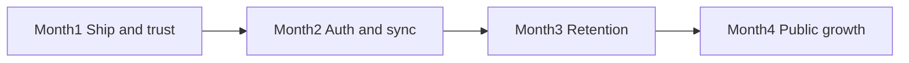
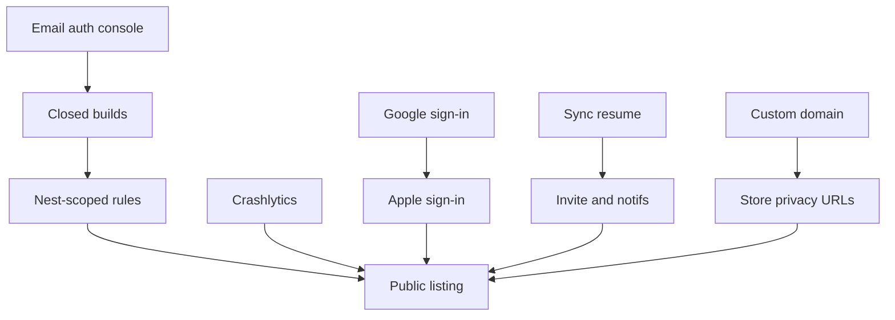

# Nestly — 4-month week-by-week plan

**Window:** Week of **3 Aug 2026 → 22 Nov 2026** (16 weeks)  
**North star:** Soft-launch Nestly so real families use it as their shared daily hub — *“What does our nest need today?”*  
**Aligned with:** [`FIVE_YEAR_PLAN.md`](FIVE_YEAR_PLAN.md) Year 1 (H2 2026 finish line)  
**Hard rule:** **No Nestly Plus paywall** this period. Draft packaging only in Week 16.

---

## Analysis snapshot (as of 30 Jul 2026)

### What’s already strong
- Full family OS surface: Home Today, calendar, tasks, shopping, expenses/bills, meals, care, school, vault, emergency, scan AI, privacy export/delete, onboarding, password reset
- Offline-first Drift + Firestore last-write-wins sync
- Web companion live (calendar read, tasks/lists)
- Store listing copy + iPhone screenshots largely ready (`store/`)

### What’s blocking soft launch (not missing modules)
| Blocker | Why it matters |
|---------|----------------|
| Store closed → public not submitted | No real households |
| Email/Password may still be unset in Firebase Console | Auth dead on device |
| Firestore/Storage rules = any signed-in user | Unsafe for public traffic |
| No Crashlytics / Analytics | Can’t see crashes or funnel |
| Email-only auth | High signup friction |
| Sync = manual / post-mutation `syncAll`, silent failures | Trust killer |
| Showcase seed in Nest settings | Risk of wiping real nests with demo data |

### Explicit non-goals (these 16 weeks)
- Nestly Plus billing / paywall
- Role-based permissions engine (Year 3)
- Full web parity (meals/care/vault/scan)
- Marketplace / chatbots / social feed
- New major modules (stick to polish + trust)

### Capacity assumption
Founder-led + AI/agent help. Each week lists **Build**, **Manual**, **Exit criteria**. Adjust one week if a release build or App Review blocks progress — don’t skip trust weeks.

---

## Month 1 — Ship & trust  
**Theme:** Get Nestly into testers’ hands without leaking every nest to every signed-in user.

### Week 1 — 3–9 Aug · Store prep lockdown
**Goal:** Checklist green for closed testing upload.

| Type | Work |
|------|------|
| **Manual** | Enable Email/Password in Firebase Auth for `nestly-family-os` |
| **Manual** | Confirm `app.nestly.family` matches Play / App Store Connect |
| **Manual** | Upload privacy + support URLs (Netlify pages already exist); note pending custom domain |
| **Manual** | Fill Data Safety / App Privacy from `store/APP_STORE_LISTING.md` |
| **Build** | Final pass on `STORE_CHECKLIST.md` — tick what’s done |
| **Build** | Gate or hide “Load showcase data” behind `kDebugMode` / profile flavor |

**Exit:** Email auth works on a fresh install; showcase seed cannot run in release builds; checklist ready for binary upload.

---

### Week 2 — 10–16 Aug · Release binaries + closed tracks
**Goal:** Closed testing packages submitted.

| Type | Work |
|------|------|
| **Manual** | Android signing (`key.properties` local) → `flutter build appbundle` |
| **Manual** | iOS archive → TestFlight internal |
| **Manual** | Create Play closed testing track; invite 5–15 testers |
| **Manual** | Upload screenshots `store/screenshots/iphone-1242x2688/` |
| **Build** | Fix any release-mode crashes (ProGuard / bitcode / permissions) |

**Exit:** Closed track live on at least one store; ≥3 external testers invited.

---

### Week 3 — 17–23 Aug · Observability baseline
**Goal:** Crashes and basic usage are visible.

| Type | Work |
|------|------|
| **Build** | Add Firebase Crashlytics (iOS + Android) |
| **Build** | Add Firebase Analytics (or equivalent): `sign_up`, `nest_created`, `nest_joined`, `sync_success`, `sync_fail` |
| **Build** | Log non-fatal sync failures with nestId/uid (no PII content) |
| **Manual** | Verify Crashlytics test crash in closed build |
| **Build** | Smoke tests still green; document events in README |

**Exit:** Dashboard shows sessions + crash-free users from closed testers.

---

### Week 4 — 24–30 Aug · Nest-scoped security rules
**Goal:** Public-ready trust floor for data.

| Type | Work |
|------|------|
| **Build** | Rewrite `firestore.rules`: read/write only if `request.auth.uid` is nest member (or owns `users/{uid}`) |
| **Build** | Rewrite `storage.rules`: paths under `nests/{nestId}/…` require membership |
| **Build** | Deploy rules; add emulator or documented manual rule tests |
| **Build** | Fix any client assumptions broken by stricter rules |
| **Manual** | Two-account penetration: user A cannot read nest B |

**Exit:** Rules deployed; cross-nest access blocked; sync still works for members.

---

## Month 2 — Auth friction & sync reliability  
**Theme:** Make joining easy and sync boringly reliable.

### Week 5 — 31 Aug–6 Sep · Sync status & resume
**Goal:** Users see sync health; app retries without tapping Sync.

| Type | Work |
|------|------|
| **Build** | Foreground / resume → `syncAll()` with debounce |
| **Build** | Surface sync failure SnackBar / banner (reuse or wire `SyncStatusBanner`) |
| **Build** | Last-sync timestamp on Nest screen |
| **Build** | Replace silent `catch (_)` on critical mutations with user-visible errors |
| **Build** | Repository/unit tests for dirty-flag happy path if feasible |

**Exit:** Airplane → edit → online → auto sync within ~5s of resume; failure is visible.

---

### Week 6 — 7–13 Sep · Vault upload reliability
**Goal:** Vault files don’t silently “defer” forever.

| Type | Work |
|------|------|
| **Build** | Retry queue for pending Storage uploads |
| **Build** | UI badge: “Waiting to upload” vs “Synced” |
| **Build** | Manual “Retry uploads” on Vault |
| **Build** | Tester bug bash script: offline pick → online upload |
| **Manual** | Closed testers upload passport/insurance sample |

**Exit:** Offline-created vault docs upload after reconnect without re-pick.

---

### Week 7 — 14–20 Sep · Google sign-in
**Goal:** One-tap signup on Android (+ iOS Google).

| Type | Work |
|------|------|
| **Build** | `google_sign_in` + Firebase credential link |
| **Build** | Auth UI: Continue with Google; keep email path |
| **Build** | Reauth path for delete account when Google provider |
| **Manual** | Firebase Console OAuth client IDs; SHA-1 for Android |
| **Build** | Friendly errors for canceled / network |

**Exit:** Closed build can create nest via Google; existing email users unaffected.

---

### Week 8 — 21–27 Sep · Apple sign-in + domain
**Goal:** iOS App Review–ready auth + professional URLs.

| Type | Work |
|------|------|
| **Build** | Sign in with Apple (iOS required if Google offered) |
| **Build** | Web companion authorized domains |
| **Manual** | Point `nestly.app` (or chosen domain) → privacy + support |
| **Manual** | Update store listing + in-app privacy links |
| **Build** | Onboarding copy fix: quiet AI (no overclaim “assigns chores”) |

**Exit:** Apple auth works on TestFlight; store URLs use custom domain.

---

## Month 3 — Retention loops  
**Theme:** Second member joins; reminders and coaching create weekly habit.

### Week 9 — 28 Sep–4 Oct · Funnel instrumentation
**Goal:** Know where nests die.

| Type | Work |
|------|------|
| **Build** | Events: `onboarding_complete`, `invite_copied`, `second_member_joined`, `first_task_done`, `day7_open` (client heuristic or Analytics audiences) |
| **Build** | Simple Nest “health” debug row (member count, last sync) — debug/profile only |
| **Manual** | Spreadsheet / Analytics dashboard for closed cohort |
| **Build** | Fix top crash from Weeks 3–8 |

**Exit:** You can answer: % nests with 2+ members within 7 days.

---

### Week 10 — 5–11 Oct · Invite & empty-state coaching
**Goal:** Time-to-aha under 10 minutes.

| Type | Work |
|------|------|
| **Build** | Post-create nest: guided “Invite your partner” sheet (share code / share sheet) |
| **Build** | First-run empty states: Calendar / Tasks / Shop with one-tap examples |
| **Build** | Home empty Today: clearer CTA to add event or invite |
| **Build** | Deep link or paste-friendly invite code UX polish |
| **Manual** | 5 moderated installs with friends/family; note drop-offs |

**Exit:** Scripted path: signup → nest → invite → join → check off task in ≤10 min.

---

### Week 11 — 12–18 Oct · Notification reliability
**Goal:** Bills / care / school reminders actually fire and open the right place.

| Type | Work |
|------|------|
| **Build** | Notification tap → route to Expenses / Care / School |
| **Build** | Re-schedule audit after sync pull |
| **Build** | Android exact-alarm / permission UX where needed |
| **Build** | Permission rationale copy on Nest |
| **Manual** | Device matrix: Pixel + one Samsung + one iPhone |

**Exit:** Bill due-tomorrow reminder opens Budget; care due opens Care.

---

### Week 12 — 19–25 Oct · Closed tester bug bash
**Goal:** Kill join / vault / sync sharp edges before public.

| Type | Work |
|------|------|
| **Manual** | Structured bash from `STORE_CHECKLIST.md` tester flow × 10 nests |
| **Build** | Fix P0/P1 bugs only (crash, data loss, can’t join, can’t sync) |
| **Build** | Grocery habits: either sync across nest devices **or** label “On this device” clearly |
| **Build** | Remove dead `mock_data.dart` if still unused |
| **Manual** | Expand closed testers to 25–50 |

**Exit:** No open P0s; written release notes for public candidate.

---

## Month 4 — Soft public growth  
**Theme:** Public listings + light growth polish; still free.

### Week 13 — 26 Oct–1 Nov · Public listing candidate
**Goal:** Submit for production / external TestFlight.

| Type | Work |
|------|------|
| **Manual** | Play production rollout (staged 20% → 100%) |
| **Manual** | App Store review submission |
| **Build** | Version bump + What’s New from shipped weeks |
| **Manual** | App Review demo account documented |
| **Build** | Hotfix process documented (1-page in README or store/) |

**Exit:** At least one store in review or live; other in flight.

---

### Week 14 — 2–8 Nov · Accessibility & Home polish
**Goal:** First public impression feels calm and usable.

| Type | Work |
|------|------|
| **Build** | Semantics / labels on Home FAB, nav, invite copy |
| **Build** | Dynamic type spot-check on Nest + Auth |
| **Build** | Reduced-motion: skip infinite shimmer when `disableAnimations` |
| **Build** | Home loading → content transition polish |
| **Build** | Budget: make month budget editable (kill hardcoded 1800) — small win |

**Exit:** TalkBack/VoiceOver can invite a member and add a task.

---

### Week 15 — 9–15 Nov · Light web companion deepen
**Goal:** Desk-mode parents can add calendar events + see bills.

| Type | Work |
|------|------|
| **Build** | Web: add/edit calendar event |
| **Build** | Web: read-only bills list (due / paid) |
| **Manual** | Redeploy Netlify; Auth authorized domains confirmed |
| **Build** | Don’t wire unused parse-document unless Blaze ready |

**Exit:** Web can create an event that appears on mobile after sync/refresh.

---

### Week 16 — 16–22 Nov · Public growth + Plus draft (no ship)
**Goal:** Stabilize public; decide Plus packaging on paper.

| Type | Work |
|------|------|
| **Manual** | Respond to reviews; triage public crashes |
| **Build** | Only P0 hotfixes |
| **Manual** | Write Nestly Plus one-pager (free vs Plus) — **do not implement** |
| **Manual** | Update `FIVE_YEAR_PLAN.md` / README Year 1 checkboxes |
| **Manual** | Retrospect 4 months: keep / kill / delay list for H1 2027 |

**Exit:** Public live (or clear App Review path); Plus draft filed; Q1 2027 priorities chosen.

---

## Week-by-week scoreboard

| Week | Theme | Primary exit |
|------|--------|--------------|
| 1 | Store prep | Auth on + showcase gated |
| 2 | Closed binaries | Closed track live |
| 3 | Crashlytics / Analytics | Events visible |
| 4 | Nest-scoped rules | Cross-nest blocked |
| 5 | Sync resume | Auto sync + visible fail |
| 6 | Vault retry | Offline upload recovers |
| 7 | Google sign-in | Google nest create |
| 8 | Apple + domain | URLs + Apple auth |
| 9 | Funnel metrics | 2-member rate known |
| 10 | Invite coaching | ≤10 min aha path |
| 11 | Notifications | Tap routes work |
| 12 | Bug bash | No P0s |
| 13 | Public submit | In review / staged |
| 14 | A11y + budget | Accessible invite |
| 15 | Web deepen | Web add event |
| 16 | Stabilize + Plus draft | Public + draft only |

---

## Metrics to watch (weekly)

| Metric | Soft-launch target by Week 16 |
|--------|-------------------------------|
| Crash-free sessions | ≥99% |
| Nests created (lifetime) | Growing; aim ≥100 closed+public combined |
| Nests with 2+ members | ≥25% of nests aged ≥7 days |
| Day-7 return (any member) | Track; improve week over week |
| Sync fail rate (events) | Trending down after Week 5 |
| Support / DM issues | Join + vault + sync < 50% of tickets |

---

## Dependency map

---

## How to run this plan

1. **Monday:** pick the week’s Build + Manual; create a short checklist issue or todo  
2. **Friday:** mark exit criteria pass/fail; slip only into next week’s buffer (Week 12 / 16)  
3. **Don’t** start new modules if Weeks 1–4 aren’t green  
4. Update `STORE_CHECKLIST.md` and README Year 1 boxes as items complete  
5. After Week 16, fold outcomes into Year 1 H1 2027 in `FIVE_YEAR_PLAN.md`

---

## Related docs

- [`FIVE_YEAR_PLAN.md`](FIVE_YEAR_PLAN.md) — multi-year strategy  
- [`STORE_CHECKLIST.md`](STORE_CHECKLIST.md) — closed testing steps  
- [`store/APP_STORE_LISTING.md`](store/APP_STORE_LISTING.md) — listing copy & privacy answers  
- [`README.md`](README.md) — Year 1/2 shipped status  

**Bottom line:** The product surface is ready. These 16 weeks buy **trust, distribution, auth ease, sync reliability, and retention instrumentation** — the actual soft-launch work.
