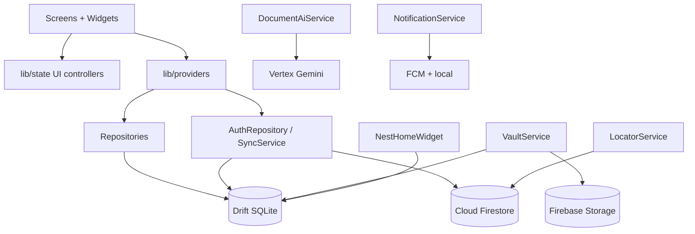

# Casaio — Current Implementation Document

**Product:** Casaio — the operating system for modern families  
**Repo / package:** `nestly`  
**Version:** `1.0.0+1` (see `pubspec.yaml`)  
**Document date:** 8 Aug 2026  
**Scope:** What is implemented in this Flutter app today (not a roadmap).

---

## 1. Product summary

Casaio is an offline-first **family OS** mobile app. A household (“nest”) shares tasks, shopping, calendar, money, documents, meals, care, school, emergency info, and an activity timeline. Members authenticate with Firebase, join via invite code, and sync through Cloud Firestore while the UI reads local SQLite (Drift).

**Marketing site:** https://casaio.app (separate repo / Cloudflare Pages)  
**Firebase project:** `nestly-family-os`  
**Bundle / application id:** `app.nestly.family` (unchanged for Firebase continuity)

---

## 2. Tech stack

| Layer | Choice |
|-------|--------|
| UI | Flutter, Material 3 |
| State | Riverpod (`flutter_riverpod`) |
| Local DB | Drift (SQLite), schema version **13** |
| Auth | Firebase Auth (email/password) |
| Sync | Cloud Firestore (last-write-wins style) |
| Files | Firebase Storage (vault) |
| Push / local alerts | FCM + `flutter_local_notifications` |
| AI scan | Firebase AI Logic → Vertex AI Gemini |
| Maps / location | Google Maps + Geolocator (opt-in Locator) |
| Home screen widgets | `home_widget` + native Android/iOS extensions |
| Telemetry | Firebase Analytics + Crashlytics |
| i18n | `flutter_localizations` + ARB (`en`, `ar`) |
| Fonts | Plus Jakarta Sans (EN); Noto Sans Arabic (AR) |
| Document API (web/Netlify) | Optional/legacy `parse-document` function |

---

## 3. Architecture overview



### Layering rules

| Folder | Responsibility |
|--------|----------------|
| `lib/screens/` | Feature UI |
| `lib/state/` | Ephemeral UI state only (filters, busy flags, form controllers) — **no DB/network** |
| `lib/providers/` | Riverpod wiring to auth, nest, repos, streams |
| `lib/data/` | Drift, repositories, sync, Firebase services |
| `lib/widgets/` | Shared UI |
| `lib/theme/` | Colors, theme, motion |
| `lib/l10n/` | ARB + generated localizations |
| `lib/navigation/` | Root navigator, deep links, notification intents |

---

## 4. App boot and navigation

### 4.1 Entry (`lib/main.dart`)

1. Initialize Flutter bindings and status bar styling  
2. `Firebase.initializeApp`  
3. Telemetry (Analytics / Crashlytics)  
4. Register FCM background handler  
5. Configure home widget App Group / Android widget  
6. Open `AppDatabase`, inject via `ProviderScope` override  
7. Build `CasaioApp` → `MaterialApp` with locale + theme → `home: AuthGate`  
8. Bind widget launch URLs to `openCasaioUri`

### 4.2 Auth gate flow

```
No user → Onboarding (once) → AuthScreen (sign in / sign up)
Signed in, no nest → NestSetupScreen (create or join)
Signed in + nest → bind nest, quiet sync, notifications, widget → AppShell
```

### 4.3 Main shell (`AppShell`)

| Tab index | Label | Screen |
|-----------|-------|--------|
| 0 | Home | `HomeScreen` |
| 1 | Calendar | `CalendarScreen` |
| 2 | Tasks | `TasksScreen` |
| 3 | Shop | `ShoppingScreen` |
| 4 | Nest | `MoreScreen` |

- **Center FAB:** add event / task / shopping item / expense / bill / **scan document**  
- **System back:** non-home tab → Home; on Home, double-back within ~2s to exit  

### 4.4 Deep links

| Scheme | Status |
|--------|--------|
| `casaio://` | Primary |
| `nestly://` | Legacy, still accepted |

Supported paths (examples): `home`, `calendar`, `tasks`, `meals` / `dinner`, `shopping`.  
Home widget and notification payloads also route into tabs or pushed screens.

---

## 5. Auth and nest model

### Auth

- Email + password only (`signUp`, `signIn`, reset password, change password)  
- Friendly error mapping in `auth_errors.dart`  
- Re-auth used for destructive privacy flows (account delete)  
- **Not implemented:** Apple Sign-In, Google Sign-In  

### Nest

| Action | Behavior |
|--------|----------|
| **Create** | New nest UUID, 6-char invite code (`inviteCodes/{code}` → nestId), creator as **Adult** |
| **Join** | Normalize code → lookup invite → add member (**Member**, pastel color) → set `users/{uid}.nestId` |
| **Members** | Mirrored Firestore ↔ Drift; roles (Adult, Co-parent, Kid, Grandparent, Member) |
| **Bind nest** | If nest changes, wipe local household data; ensure default “Groceries” list |

Invite UX lives on Nest tab (`invite_family_sheet`) and Home coaching tips.

---

## 6. Data layer

### 6.1 Drift tables (schema v13)

| Table | Role |
|-------|------|
| `NestMembers` | Family members (name, role, initials, color) |
| `Tasks` | Assignable tasks |
| `ShoppingLists` / `ShoppingItems` | Shared lists |
| `CalendarEvents` | Events (member, category, times) |
| `Expenses` / `Bills` | Money + due bills |
| `EmergencyEntries` | Critical contacts/notes |
| `VaultDocuments` | Document metadata + local/remote paths |
| `TimelineEvents` | Activity wall |
| `MealPlans` | Weekly meals + ingredients |
| `CareItems` / `CareProfiles` | Care cadence + elder profiles |
| `SchoolActivities` | School / sports / pickups |
| `NestSettings` | Month budget, tomorrow preview flag |
| `SyncMeta` | nestId, lastSync, locale, tips, flags |
| `GroceryHabits` | **Device-local** buy memory (not cloud-synced) |

Synced entities typically carry: `nestId`, `dirty`, soft `deleted`, `updatedAt`.

### 6.2 Repositories

`lib/data/repositories.dart` exposes watch/CRUD for tasks, shopping, events, members, expenses, bills, emergency, timeline, vault, meals, care, school. Writes mark rows dirty for sync.

### 6.3 Sync model

- **Offline-first:** UI streams from Drift; writes hit SQLite first  
- **Push then pull** across nest collections  
- **Conflict policy:** keep local if row is dirty **or** local `updatedAt` is after remote (LWW-ish)  
- **Vault:** upload/retry via Storage; metadata in Firestore  
- **Locator:** separate Firestore `locations` subcollection (not Drift LWW)  
- **Not synced:** grocery habits, locale preference, tip/review meta  

`SyncController` coalesces UI-triggered sync, resume debounce, and status banner.

### 6.4 Firestore nest shape (conceptual)

Under `nests/{nestId}/`:  
`members`, `tasks`, `shoppingLists`, `shoppingItems`, `events`, `expenses`, `bills`, `emergency`, `vault`, `timeline`, `meals`, `care`, `careProfiles`, `school`, `locations`, plus nest settings.

**Security note:** current `firestore.rules` / `storage.rules` allow any signed-in user broad read/write (nest-scoped hardening deferred).

---

## 7. Features implemented

### 7.1 Home

- “Today for your nest” quiet needs summary (`family_needs.dart`)  
- Upcoming events, open tasks, bills/care/school signals  
- Feature grid into modules  
- Invite / solo tips (`home_tips.dart`)  
- No chatbot — local ranking only  

### 7.2 Calendar

- Month / week browsing, member filters  
- Expanding search header (animated)  
- Synced events; notification deep-link support  

### 7.3 Tasks & shopping

- Tasks: assignee filter, search, done toggle, sync  
- Shopping: categories, bought filter, clear-done patterns  
- Device-local grocery suggestions from `GroceryHabits`  
- Meals can push ingredients into the shopping list  

### 7.4 Nest hub (More)

- Invite family, members & roles  
- Language (system / English / Arabic)  
- Links: timeline, locator, vault, expenses, emergency, meals, care, school, privacy, about  
- Sync status, change password, account actions  

### 7.5 Expenses & bills

- Expense log + bills with due dates  
- Nest month budget (`NestSettings`)  
- Local bill reminders  

### 7.6 Vault

- Category folders, pick/upload files  
- Local file first → Firebase Storage  
- Upload status: local / uploading / synced / failed + retry  

### 7.7 Emergency

- Offline-first critical labels/values for the nest  
- Synced like other household data  

### 7.8 Timeline

- Family activity wall with module filters  
- Messages classified for navigation (`timeline_nav.dart`)  

### 7.9 Meals

- Week plan by weekday / meal type  
- Ingredients → shopping  

### 7.10 Care & school

- Care: cadence items + elder profiles (meds, allergies, etc.)  
- School: activities, sports, pickups with due/next  
- Feed Home counts and local reminder intents  

### 7.11 Locator

- Opt-in last-known location sharing  
- Google Map with pastel style + member markers  
- Live Firestore locations (not full offline LWW)  

### 7.12 Privacy

- In-app privacy summary  
- Export nest JSON  
- Leave nest / delete account & cloud data helpers  

### 7.13 Document scan (AI)

- FAB flow: pick image/PDF → Gemini parse → review → create event/expense/task/bill drafts  
- Requires network + Firebase AI / Vertex (Blaze)  

### 7.14 Notifications

- FCM token registration  
- Local reminders (bills, care, school, etc.)  
- Tap payload → destination screen/tab  

### 7.15 Home screen widget

- Privacy-safe snapshot: open tasks, next event, dinner hint  
- Deep links into app (`casaio://…`)  
- Native: Android `NestlyHomeWidget`, iOS widget extension  
- Display label: “Casaio Today”  

### 7.16 Onboarding & about

- First-run carousel before auth  
- About screen with product copy  

---

## 8. Internationalization (i18n)

| Item | Detail |
|------|--------|
| Locales | English (`en`), Arabic (`ar`) |
| Sources | `lib/l10n/app_en.arb`, `app_ar.arb` |
| Config | `l10n.yaml` |
| Preference | system / english / arabic in `SyncMeta` (`locale_preference.dart`) |
| RTL | Automatic via Arabic locale |
| Theme | Arabic → Noto Sans Arabic; else Plus Jakarta Sans |
| Native widgets | Android `values` / `values-ar`; iOS `en.lproj` / `ar.lproj` |

UI strings go through `context.l10n`. Some storage enum labels and historical timeline messages may remain English by design.

---

## 9. Theming & design system

- Soft pastel productivity palette (`app_colors.dart`): lavender, mint, peach, pink, teal, yellow  
- Member avatars: `avatarFill` + luminance-aware `onAvatarFill` (white on deeper fills, ink on light)  
- Motion tokens in `app_motion.dart`; reduced-motion helpers in `nest_a11y.dart`  
- Brand assets under `assets/brand/logos/` (Casaio marks / app icon)

---

## 10. Native platforms

| | Android | iOS |
|--|---------|-----|
| Display name | Casaio | Casaio |
| Application / bundle id | `app.nestly.family` | `app.nestly.family` |
| Widget class / extension | `NestlyHomeWidget` | `NestlyHomeWidget` |
| App Group | — | `group.app.nestly.family` |
| URL schemes | `casaio`, `nestly` | same |
| Notable permissions | Network, notifications, location when-in-use | Location when-in-use, Maps key, etc. |

---

## 11. Backend and adjacent infra

| Piece | Role |
|-------|------|
| Firebase Auth | Email/password users |
| Firestore | Nest documents + invite codes + user → nestId |
| Storage | Vault binaries |
| FCM | Push token registration |
| Firebase AI / Vertex | On-device scan path |
| Crashlytics / Analytics | Crashes + product events |
| Netlify (`web/` + functions) | Redirects toward casaio.app; `parse-document` API (Bearer + Gemini) — legacy/alternate to mobile AI |
| Marketing site | Privacy / support / landing at casaio.app (not this repo’s primary surface) |

---

## 12. Brand vs technical identifiers

| Layer | Value |
|-------|--------|
| Product name (UI, stores, copy) | **Casaio** |
| Deep link (primary) | `casaio://` |
| Domain | `casaio.app` |
| Flutter package name | `nestly` |
| Imports | `package:nestly/...` |
| Firebase project | `nestly-family-os` |
| App id | `app.nestly.family` |
| Widget / telemetry class names | Often still `Nestly*` |
| Legacy deep link | `nestly://` still accepted |
| Domain metaphor in copy | “nest” kept intentionally |

---

## 13. Automated tests

Located under `test/`:

| Test | Focus |
|------|--------|
| `widget_test.dart` | App smoke |
| `onboarding_test.dart` | Onboarding + in-memory DB |
| `repositories_test.dart` | Drift repository behavior |
| `sync_controller_test.dart` | Last-synced formatting |
| `locale_preference_test.dart` | Locale resolve + l10n |
| `family_needs_test.dart` | Home needs ranking |
| `invite_family_sheet_test.dart` | Invite normalize / share |
| `nest_privacy_service_test.dart` | Privacy helpers |
| `notification_intent_test.dart` | Payload → destination |
| `nest_home_widget_test.dart` | Widget snapshot/hero |
| `locator_models_test.dart` | Location age formatting |
| `calendar_view_math_test.dart` | Week math |
| `timeline_nav_test.dart` | Message → module |
| `vault_upload_status_test.dart` | Upload status helpers |
| `vault_ui_controller_test.dart` | Vault UI stack |
| `review_prompt_test.dart` | In-app review gate |

---

## 14. Explicitly not implemented / deferred

- Apple / Google social login  
- In-app purchases / Casaio Plus paywall (one-pager only: `store/NESTLY_PLUS_ONE_PAGER.md`)  
- Nest-scoped Firestore / Storage security rules rewrite  
- Flutter web companion (paused; marketing site is separate)  
- Custom email domain / SPF-DKIM for reset mail (needs owned domain)  
- Interactive App Intents / Locator-on-widget  
- Full store listing submission automation (manual: `STORE_CHECKLIST.md`)  

Manual console steps still required for some environments (Email/Password provider, Maps keys, Vertex/Blaze for AI).

---

## 15. How to run

```bash
flutter pub get
dart run build_runner build   # if Drift codegen needed
flutter run
```

Regenerate l10n when ARBs change (Flutter gen-l10n / IDE).  
Firebase Email/Password must be enabled on project `nestly-family-os` before sign-up works.

---

## 16. Related docs in repo

| File | Contents |
|------|----------|
| `README.md` | Stack, Firebase, Year 1/2 status checklist |
| `FOUR_MONTH_PLAN.md` | 16-week execution plan |
| `STORE_CHECKLIST.md` | Store / closed-testing checklist |
| `store/APP_STORE_LISTING.md` | Listing copy |
| `store/LOCATOR_MAPS_SETUP.md` | Maps keys setup |
| `store/NESTLY_PLUS_ONE_PAGER.md` | Plus product one-pager (no billing code) |
| `plans/` | Feature plans (i18n, widgets, UI state, gaps) |
| `lib/state/README.md` | UI-state conventions |
| `lib/l10n/README.md` | Localization key conventions |

---

## 17. Capability matrix (quick reference)

| Capability | Offline UI | Cloud sync | Notes |
|------------|------------|------------|-------|
| Auth | — | Firebase Auth | Email/password |
| Members / nest | Yes | Yes | Invite codes |
| Tasks | Yes | Yes | |
| Shopping | Yes | Yes | Habits local-only |
| Calendar | Yes | Yes | |
| Expenses / bills | Yes | Yes | Local reminders |
| Emergency | Yes | Yes | |
| Vault | Yes (local files) | Meta + Storage | Retry queue |
| Timeline | Yes | Yes | |
| Meals | Yes | Yes | → shopping |
| Care / school | Yes | Yes | |
| Locator | Share flag local | Live Firestore | Needs Maps |
| Home widget | Snapshot local | Refresh after sync | No vault content |
| Scan AI | Needs network | Saves synced entities | Vertex |
| Locale | Local preference | Not nest-synced | en / ar |
| Privacy export/delete | — | Cloud helpers | |

---

*This document describes the codebase as of the date above. Prefer the source under `lib/` when behavior and docs disagree.*
